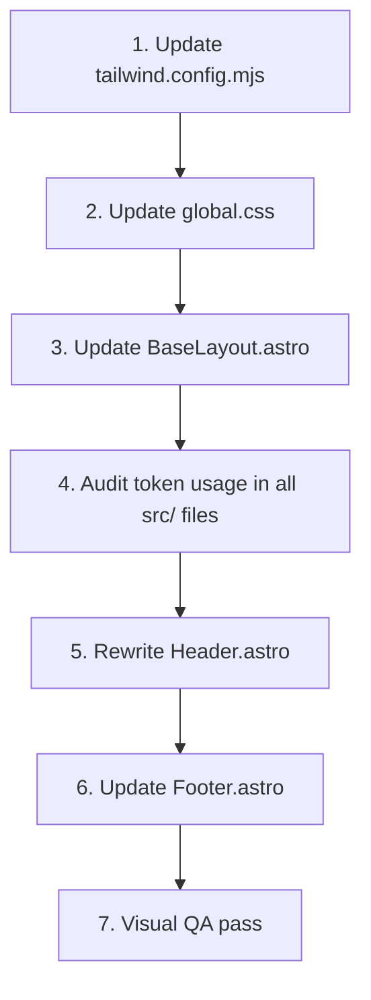

# DESIGN ALIGNMENT SPEC — V7
## EOS CLUB Astro Theme → Design System Reconciliation

**Source of Truth:** `design_system.html` (V7, Feb 2026)
**Target:** Align all Astro site components with V7 design tokens, typography, and visual language
**Layout Decision:** Top navigation bar retained on desktop; mobile menu upgraded to full slide-in sidebar panel

---

## 0. Executive Summary of Gaps

The current Astro theme diverges from the V7 design system in the following critical areas:

| Area | Gap | Severity |
|---|---|---|
| Tailwind colors | Missing `contrast`, `subtle`, `zen` tokens; extra non-DS tokens present | Critical |
| Tailwind gradients | Wrong names + wrong values; missing `heat-gradient`, `wash-gradient` | High |
| Typography | Merriweather not loading full weight range; h2–h6 headings not in accent red | High |
| Header logo | Using black logo (`bm-black`) instead of red logo (`wb-red`) | High |
| Nav link style | Nav links use `text-eos-text` (dark) until active; DS requires ALL links in `text-eos-accent` (red) | High |
| Mobile menu | Dropdown below header; DS requires full-height slide-in sidebar with overlay | High |
| Footer color | Uses `eos-charcoal` (#2D2D2D) instead of `eos-contrast` (#2F3A40) | Medium |
| Utility classes | Missing `.btn-primary`, `.btn-secondary`, `.grain-texture`, `.spotlight-card`, `.no-scrollbar`, `.portrait-glow` | Medium |
| Scrollbar | Default browser scrollbar; DS defines accent-red custom scrollbar | Low |
| Global CSS | Missing scroll-smooth, `scroll-behavior`, font weight range | Low |

---

## 1. Design Tokens — `tailwind.config.mjs`

**Full replacement of the `theme.extend` block.**

### 1.1 Color Tokens

Remove all current `eos.*` tokens and replace with the exact V7 palette:

```js
colors: {
  eos: {
    'base':     '#F9F9F7',   // 60% — Mineral White — dominant background
    'contrast': '#2F3A40',   // 30% — Deep Slate — secondary / structural elements
    'accent':   '#FF2E00',   // 10% — Infrared Red — CTAs, headings, active states
    'subtle':   '#E6E5E0',   // Warm Concrete — borders, secondary backgrounds
    'text':     '#1F2933',   // Night Slate — body text (never pure black)
    'zen':      '#09090B',   // Zen Black — inputs and dark surfaces
  }
}
```

> **Removed tokens:** `accent-dark`, `accent-light`, `cool`, `cool-light`, `muted`, `warm-white`, `cream`, `charcoal`
>
> **Agent Note:** Before removing tokens, search all `.astro`, `.ts`, `.md` files for usages of the removed token names and replace with the nearest V7 equivalent:
> - `charcoal` → `eos-contrast`
> - `muted` → `eos-contrast/60`
> - `warm-white` → `eos-base`
> - `cream` → `eos-subtle`
> - `cool` / `cool-light` → `eos-contrast` (no direct equivalent; use contrast)

### 1.2 Gradient Tokens

Replace current `backgroundImage` with the exact V7 names and values:

```js
backgroundImage: {
  'accent-gradient': 'linear-gradient(135deg, #FF2E00 0%, #FF5C00 100%)',
  'heat-gradient':   'linear-gradient(135deg, #E9B24A 0%, #E8742C 35%, #E6534A 60%, #E24676 78%, #C74A8E 100%)',
  'wash-gradient':   'linear-gradient(135deg, #F2F4C9 0%, #FBF3D6 45%, #F8E1D5 100%)',
}
```

> **Removed gradients:** `eos-accent`, `eos-cool`, `eos-warm`
>
> **Agent Note:** Search for usages of `bg-eos-accent` (the gradient class, not the color token) and replace with `bg-accent-gradient`.

### 1.3 Font Family

```js
fontFamily: {
  'serif': ['Merriweather', 'serif'],
  'sans':  ['Geist Sans', 'Inter', 'sans-serif'],
}
```

> **Font Decision (Feb 2026):** Capitolina has been dropped. **Merriweather** (Google Fonts) is the confirmed display/heading font. Load via `<link>` in `BaseLayout.astro` — no self-hosted font files needed. Weights required: 300, 400, 700, 900.

---

## 2. Global Styles — `src/styles/global.css`

**Replace the entire file** with the following expanded definition:

### 2.1 Base Styles

```css
@tailwind base;
@tailwind components;
@tailwind utilities;

@import "geist/sans";

@layer base {
  html {
    scroll-behavior: smooth;
  }

  body {
    @apply font-sans bg-eos-base text-eos-text antialiased;
  }

  /* ALL headings: serif face + Infrared Red */
  h1, h2, h3, h4, h5, h6, .font-display {
    @apply font-serif text-eos-accent;
  }

  /* Exception pattern: headings on dark backgrounds use white */
  /* Apply via: class="!text-white" or a utility (see §2.3) */
}
```

> **V7 Typography Rule:** The design system sets ALL headings (`h1`–`h6`) to `font-family: Merriweather` AND `color: #FF2E00`. The current global.css only applies accent-red to `h1`. This is intentional per V7 — headings are navigational landmarks. Body text remains `#1F2933` (Night Slate).
>
> **Exception:** In the "Contrast Heading" example in the design system, a heading uses `text-eos-contrast` — this is achieved by overriding with `!text-eos-contrast` inline. The default rule still applies.

### 2.2 Custom Scrollbar

```css
@layer base {
  ::-webkit-scrollbar {
    width: 8px;
  }

  ::-webkit-scrollbar-track {
    background: #E6E5E0;
  }

  ::-webkit-scrollbar-thumb {
    background: #FF2E00;
    border-radius: 4px;
  }
}
```

### 2.3 Component Utility Classes

```css
@layer components {

  /* --- Buttons --- */
  .btn-primary {
    @apply bg-eos-accent text-white font-bold uppercase tracking-widest text-xs rounded-xl px-8 py-4;
    transition: all 0.2s ease;
  }
  .btn-primary:hover {
    opacity: 0.9;
    transform: translateY(-1px);
  }

  .btn-secondary {
    @apply bg-transparent border-2 border-eos-contrast text-eos-contrast font-bold uppercase tracking-widest text-xs rounded-xl px-8 py-4;
    transition: all 0.2s ease;
  }
  .btn-secondary:hover {
    @apply bg-eos-contrast text-white;
  }

  /* --- Grain Texture Overlay --- */
  /* Usage: add .grain-texture class to a container with position:relative */
  .grain-texture {
    @apply relative;
  }
  .grain-texture::before {
    content: '';
    position: absolute;
    top: 0; left: 0; right: 0; bottom: 0;
    background-image: url("data:image/svg+xml,%3Csvg viewBox='0 0 400 400' xmlns='http://www.w3.org/2000/svg'%3E%3Cfilter id='noiseFilter'%3E%3CfeTurbulence type='fractalNoise' baseFrequency='0.9' numOctaves='3' stitchTiles='stitch'/%3E%3C/filter%3E%3Crect width='100%25' height='100%25' filter='url(%23noiseFilter)' opacity='0.02'/%3E%3C/svg%3E");
    pointer-events: none;
    z-index: 1;
  }
  .grain-texture > * {
    position: relative;
    z-index: 2;
  }

  /* --- Sidebar / Mobile Menu Transition --- */
  .sidebar-transition {
    transition: transform 0.3s cubic-bezier(0.4, 0, 0.2, 1);
  }

  /* --- Scrollbar Hidden (mobile nav panels) --- */
  .no-scrollbar::-webkit-scrollbar { display: none; }
  .no-scrollbar {
    -ms-overflow-style: none;
    scrollbar-width: none;
  }

  /* --- Card Effects --- */
  .spotlight-card {
    position: relative;
    background: white;
  }
  .spotlight-card::before {
    content: '';
    position: absolute;
    top: -2px; left: -2px; right: -2px; bottom: -2px;
    background: radial-gradient(circle at center, rgba(255, 46, 0, 0.05) 0%, transparent 70%);
    border-radius: inherit;
    z-index: -1;
  }

  /* --- Photo + Logo Watermark --- */
  .photo-with-logo {
    position: relative;
  }
  .photo-with-logo::after {
    content: '';
    position: absolute;
    inset: 0;
    border-radius: 0.75rem;
    pointer-events: none;
    background: radial-gradient(120% 90% at 90% 85%, rgba(0,0,0,0.18) 0%, rgba(0,0,0,0.00) 55%);
    opacity: 0.55;
  }
  .photo-logo {
    position: absolute;
    right: 0.75rem;
    bottom: 0.75rem;
    z-index: 2;
    width: 84px;
    height: auto;
    opacity: 0.78;
    mix-blend-mode: multiply;
    filter: drop-shadow(0 2px 10px rgba(0,0,0,0.18));
  }

  /* --- Testimonial Portrait Glow --- */
  .portrait-glow {
    box-shadow: 0 0 20px rgba(255, 46, 0, 0.1);
  }
}

/* Reduced motion overrides */
@media (prefers-reduced-motion: reduce) {
  * { scroll-behavior: auto !important; }
  .sidebar-transition { transition: none !important; }
}
```

---

## 3. Base Layout — `src/layouts/BaseLayout.astro`

### 3.1 Font Loading

**Replace** the current Merriweather `<link>` tag with the full weight set:

```html
<!-- Google Fonts: Merriweather — confirmed display/heading font, all weights used in DS V7 -->
<link rel="preconnect" href="https://fonts.googleapis.com">
<link rel="preconnect" href="https://fonts.gstatic.com" crossorigin>
<link href="https://fonts.googleapis.com/css2?family=Merriweather:wght@300;400;700;900&family=Inter:wght@300;400;500;600;700&display=swap" rel="stylesheet">
```

> **Note:** `Geist Sans` is loaded via `@import "geist/sans"` in `global.css` (already correct). The Inter font above acts as a sans-serif fallback if Geist fails to load.

### 3.2 HTML Element

Add `class="scroll-smooth"` to the `<html>` element:

```html
<html lang={currentLocale} class="scroll-smooth">
```

---

## 4. Header Component — `src/components/common/Header.astro`

This is the most significant change in the spec. The header must be **fully rewritten** to match the V7 visual language.

### 4.1 Desktop Header

| Property | Current | Target (V7) |
|---|---|---|
| Background | `bg-eos-base/90 backdrop-blur-sm` | `bg-white/80 backdrop-blur-md` |
| Border | `border-eos-text/5` | `border-eos-subtle` |
| Logo image | `eos-logo-export_bm-black.png` (black) | `eos-logo-export_wb-red.png` (red) |
| Brand name text | Not shown | `EOS CLUB` — `font-serif font-bold text-lg tracking-wider text-eos-accent uppercase` |
| Nav link (all states) | Inactive: `text-eos-text` / Active: `text-eos-accent` | ALL links: `text-eos-accent` always |
| Nav link style | `text-sm font-medium` | `text-sm font-bold uppercase tracking-widest` |
| Active indicator | Color change only | Color (already red) + consider `underline` underline decoration for active state |
| Mobile toggle button | `text-eos-text` | `text-eos-accent` (red icon) |

**Desktop nav structure:**

```html
<header class="sticky top-0 z-50 bg-white/80 backdrop-blur-md border-b border-eos-subtle">
  <div class="container mx-auto px-6 py-4 flex items-center justify-between">
    <!-- Logo + Brand -->
    <a href={isEn ? '/en' : '/'} class="flex items-center space-x-3">
      
      <span class="font-serif font-bold text-lg tracking-wider text-eos-accent uppercase">EOS CLUB</span>
    </a>

    <!-- Desktop Nav (hidden on mobile) -->
    <nav class="hidden md:flex items-center space-x-8">
      {navItems.map((item) => {
        // ... active check logic unchanged
        return (
          <a
            href={path}
            class={`text-sm font-bold uppercase tracking-widest text-eos-accent transition-colors duration-200 hover:text-eos-accent/70 ${isActive ? 'underline underline-offset-4 decoration-eos-accent' : ''}`}
          >
            {label}
          </a>
        );
      })}
      <LangSwitch />
    </nav>

    <!-- Mobile Hamburger (red icon, visible on mobile only) -->
    <button
      id="mobile-menu-button"
      class="md:hidden p-2 text-eos-accent focus:outline-none transition-transform active:scale-95"
      aria-label="Toggle Menu"
    >
      <!-- Hamburger SVG icon -->
    </button>
  </div>
</header>
```

### 4.2 Mobile Slide-In Sidebar Panel

The current mobile dropdown (`#mobile-menu`) must be replaced with a slide-in side panel.

**Key elements to implement:**

```
[ Overlay ]        — fixed inset, bg-eos-contrast/20 backdrop-blur-sm, z-40; hidden by default
[ Sidebar Panel ]  — fixed left-0 top-0, h-screen w-full (mobile, capped at max-w-sm), bg-white,
                     z-50, transform -translate-x-full (closed) → translate-x-0 (open),
                     sidebar-transition class, overflow-y-auto no-scrollbar
  └── [ Close Button ]  — top-right, text-eos-accent, X icon
  └── [ Logo + Brand ]  — same as desktop header
  └── [ Nav Items ]     — stacked, centered, py-3, text-eos-accent, uppercase, font-bold,
                          hover:bg-eos-base rounded-xl transition
  └── [ LangSwitch ]    — bottom of nav list
  └── [ Version mark ]  — optional: "EOS CLUB" small text at base
```

**JavaScript behavior:**

```js
// State management
let isMenuOpen = false;

function openMenu() {
  isMenuOpen = true;
  sidebar.classList.remove('-translate-x-full');
  overlay.classList.remove('hidden');
  setTimeout(() => overlay.classList.add('opacity-100'), 10);
  document.body.style.overflow = 'hidden'; // scroll lock
}

function closeMenu() {
  isMenuOpen = false;
  sidebar.classList.add('-translate-x-full');
  overlay.classList.remove('opacity-100');
  setTimeout(() => overlay.classList.add('hidden'), 300); // matches transition duration
  document.body.style.overflow = '';
}

// Triggers: hamburger button, close button (X), overlay click, nav item click (mobile only)
menuButton.addEventListener('click', openMenu);
closeBtn.addEventListener('click', closeMenu);
overlay.addEventListener('click', closeMenu);
navItems.forEach(item => {
  item.addEventListener('click', () => {
    if (window.innerWidth < 768) closeMenu();
  });
});
```

> **WCAG Note:** When menu opens, focus should move to close button. When menu closes, focus should return to hamburger button. Add `tabindex` and `aria-expanded` attributes accordingly.

### 4.3 LangSwitch Placement

- **Desktop:** Inline in the main nav (current placement — keep)
- **Mobile panel:** Place within the sidebar nav, below the last nav item, above the divider

---

## 5. Footer Component — `src/components/common/Footer.astro`

The footer should be updated to use the V7 token set. The existing 3-column structure is kept but restyled.

### 5.1 Color Token Fix

| Property | Current | Target |
|---|---|---|
| Background | `bg-eos-charcoal` | `bg-eos-contrast` |
| Heading color | Inherits (white on dark bg) | Use `!text-white` override (since all h2 inherits accent red now) |
| Body text | `text-eos-muted` | `text-eos-contrast/60` or `text-white/60` |

### 5.2 Footer Link Style

Legal / utility links should match the V7 structural footer style:

```html
<a href="#" class="text-[10px] font-bold uppercase tracking-widest text-white/40 hover:text-eos-accent transition-colors">
  Impressum
</a>
```

### 5.3 Heading Override

Since `h2`/`h3` now inherit `text-eos-accent` globally, any heading on a dark surface needs an explicit override:

```html
<h2 class="font-serif text-2xl mb-4 !text-white">EOS CLUB</h2>
```

### 5.4 Newsletter Footer Variant (Optional Upgrade)

The V7 design system defines a **Variant B (Engagement)** footer. If the client approves, this can be added as an additional section above the structural footer:

```html
<div class="bg-eos-contrast rounded-2xl p-12 text-white relative overflow-hidden mb-8 grain-texture">
  <div class="relative z-10 max-w-xl mx-auto text-center">
    <h3 class="text-3xl font-bold mb-4 uppercase tracking-tighter italic !text-white">Stay Lucid</h3>
    <p class="text-white/60 mb-8">Weekly insights on conscious movement and community growth.</p>
    <!-- EmailSignup component here -->
  </div>
</div>
```

> This variant uses the existing `EmailSignup.astro` component. Treat as optional for this pass — mark as a follow-up task if not explicitly requested.

---

## 6. Component Audit — Token Usage After Token Update

After modifying `tailwind.config.mjs`, the agent must audit all component files for broken token references and update them:

### 6.1 Files to Audit

| File | Watch For |
|---|---|
| `src/components/common/Header.astro` | (rewritten in this task) |
| `src/components/common/Footer.astro` | `eos-charcoal`, `eos-muted` |
| `src/components/blocks/HeroBlock.astro` | Any use of `eos-cool`, `eos-warm-white`, `eos-cream` |
| `src/components/blocks/FeatureGridBlock.astro` | Any cool-tone colors |
| `src/components/EmailSignup.astro` | Background colors, button classes |
| `src/pages/impressum.astro` | Heading colors, container styling |

### 6.2 Search Patterns

Run these searches across `src/`:

```
bg-eos-charcoal → bg-eos-contrast
text-eos-charcoal → text-eos-contrast
bg-eos-muted → bg-eos-contrast/60
text-eos-muted → text-eos-contrast/60
bg-eos-warm-white → bg-eos-base
bg-eos-cream → bg-eos-subtle
bg-eos-cool → bg-eos-contrast
bg-eos-accent (gradient class) → bg-accent-gradient
```

---

## 7. Typography Reference

### 7.1 Type Scale (Tailwind defaults, no extension needed)

| Usage | Class | Weight | Color |
|---|---|---|---|
| Display / Hero H1 | `text-5xl lg:text-7xl font-bold` | Bold | `text-eos-accent` (from global rule) |
| Section H2 | `text-3xl lg:text-4xl font-bold` | Bold | `text-eos-accent` (from global rule) |
| Card H3 | `text-lg font-bold` | Bold | `text-eos-accent` (from global rule) |
| Body text | `text-base` or `text-lg` leading-relaxed | Regular | `text-eos-contrast/80` |
| Labels / caps | `text-[10px] font-bold uppercase tracking-widest` | Bold | `text-eos-accent` |
| Mono / code | `font-mono text-xs uppercase tracking-widest` | — | `text-eos-accent` or `text-eos-contrast/50` |

### 7.2 Heading Overrides

When a heading must NOT be red (e.g. on a dark background or in a contrast role):

```html
<h3 class="!text-eos-contrast">The 60:30:10 Rule</h3>   <!-- dark surface light card -->
<h2 class="!text-white">Stay Lucid</h2>                  <!-- on eos-contrast bg -->
```

---

## 8. The 60:30:10 Ratio — Application Guide

This ratio is the *spirit* of the design, not a mathematical constraint. Apply as follows:

| Token | Ratio | Typical Usage |
|---|---|---|
| `eos-base` `#F9F9F7` | 60% | Page backgrounds, card fills, default surface |
| `eos-contrast` `#2F3A40` | 30% | Footer, dark sections, text-heavy panels, input backgrounds (`eos-zen`) |
| `eos-accent` `#FF2E00` | 10% | Headings, all nav links, CTAs, active states, scrollbar thumb, icon accents |

> **Do not** use `eos-accent` for body text. Reserve it for navigational landmarks and emphasis as stated in the V7 typography section: *"Emphasis is deliberate."*

---

## 9. Execution Order for Implementation Agent

Tasks must be executed in this dependency order:



### Task Checklist

- [ ] **T1** — `tailwind.config.mjs`: Replace color tokens, gradient tokens, and font family per §1
- [ ] **T2** — `src/styles/global.css`: Replace file with new base styles + utility classes per §2
- [ ] **T3** — `src/layouts/BaseLayout.astro`: Update font `<link>` tags + add `scroll-smooth` to `<html>` per §3
- [ ] **T4** — Audit all `src/` files for removed token references; replace per §6 token swap map
- [ ] **T5** — `src/components/common/Header.astro`: Full rewrite per §4 (desktop style + mobile slide-in sidebar)
- [ ] **T6** — `src/components/common/Footer.astro`: Update color tokens + heading overrides per §5
- [ ] **T7** — Visual QA: Build the site and review on desktop + mobile. Verify red logo, red nav, mobile slide-in, heading colors across all pages

---

## 10. QA Checklist

After implementation, verify:

- [ ] All nav links are `text-eos-accent` (red) on desktop — including inactive links
- [ ] Active nav link has an additional visual indicator (underline or similar)
- [ ] Logo is the red variant (`eos-logo-export_wb-red.png`) in the header
- [ ] "EOS CLUB" brand name appears next to logo in serif font, uppercase, accent red
- [ ] Header background is `bg-white/80 backdrop-blur-md` (white/blur, not base/90)
- [ ] All h1–h6 headings render in `font-serif` + `text-eos-accent` (red)
- [ ] Headings on dark surfaces correctly override to `!text-white` or `!text-eos-contrast`
- [ ] Mobile hamburger is red (`text-eos-accent`)
- [ ] Mobile menu opens as full slide-in panel (not dropdown), with overlay
- [ ] Body scroll locks when mobile menu is open
- [ ] Overlay click closes the mobile menu
- [ ] `sidebar-transition` gives smooth open/close animation
- [ ] `prefers-reduced-motion` disables sidebar transition
- [ ] Footer uses `bg-eos-contrast` (not `bg-eos-charcoal`)
- [ ] Custom scrollbar renders with red thumb + concrete track
- [ ] No `eos-charcoal`, `eos-cool`, `eos-muted`, or other removed tokens remain in source
- [ ] Build completes without Tailwind warnings about unknown classes

---

## 11. Out of Scope for This Pass

The following V7 elements are documented in the design system but are **not** part of this alignment task:

- `grain-texture` application to specific page sections (the utility is implemented; application is a content task)
- `.spotlight-card` application to card components (utility provided; wrapping is per-component)
- `.photo-with-logo` watermark effect (utility provided; application is per-image)
- Form elements (Zen inputs, toggle switches)
- Component variants (Feature cards, alert banners, badge types)
- Testimonial components with `.portrait-glow`
- Footer newsletter variant upgrade (flagged as optional in §5.4)

---

*Spec prepared: February 2026 | Design System Source: V7 Full Feature Edition*
