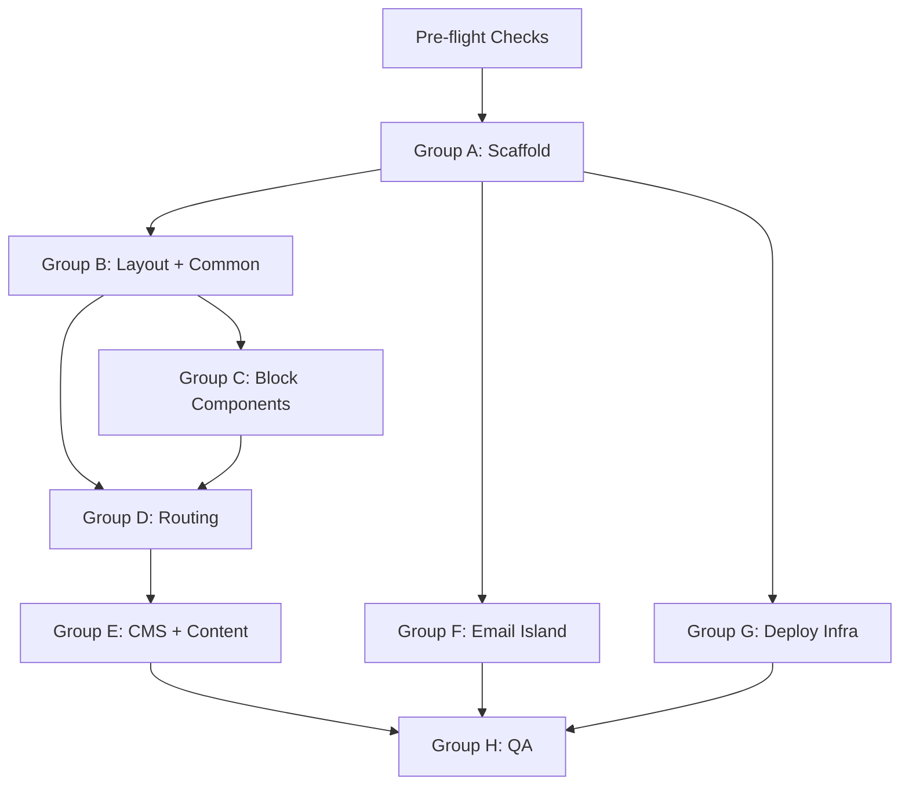

# EOS CLUB — Orchestrator Task Plan (MVP)
**Source Spec:** `plans/SPEC_MVP_v2.md`
**Current State:** Pre-launch static `index.html` only. No Astro project exists.
**Target:** Full Astro v4 SSG site with TinaCMS, TailwindCSS, GSAP, bilingual DE/EN routing.

---

## ✅ Pre-flight Checks — All Resolved

1. **Capitolina Font** — ✅ Use **Merriweather** via Google Fonts as the display/heading font. Load via `<link>` in `BaseLayout.astro`. No self-hosted font files needed.
2. **Booking Platform** — ✅ **Platform is bsport (not Eversports).** For MVP: implement as a **CTA link** that opens bsport in a popup/new tab. No widget embed or iframe required. The `BookingBlock` stores the bsport URL as `bookingUrl`. A tighter API/iframe integration is deferred to a future phase.

---

## Group A — Project Scaffold
**Mode: Code | Dependencies: None**

- [x] **A1** — Initialize a new Astro v4 project in the repo root using the empty template (`npm create astro@latest . -- --template empty --no-install`). Do NOT overwrite existing files (`assets/`, `plans/`, `.kilocode/`, `.letta/`, `archive/`, `visual_references/`). Commit scaffold files only. Ensure .gitignore excludes all upstream & sensitive files ex. node_modules, .env etc.
- [x] **A2** — Install all required dependencies: `@astrojs/tailwind`, `@astrojs/sitemap`, `@astrojs/image` (or built-in `astro:assets`), `tinacms`, `@tinacms/cli`, `gsap`. Run `npm install`.
- [x] **A3** — Create `astro.config.mjs` with: `output: 'static'`, i18n config (`defaultLocale: "de"`, `locales: ["de","en"]`, `routing: { prefixDefaultLocale: false }`), sitemap integration, image integration, and `site: 'https://eos-club.de'`.
- [x] **A4** — Create `tailwind.config.mjs` with all EOS design tokens from `plans/SPEC_MVP_v2.md` §4: full `eos` color palette, three gradient `backgroundImage` entries, and `fontFamily` (`serif: Merriweather`, `sans: Geist Sans/Inter`).
- [x] **A5** — Create `.env.example` at project root with all variables from spec §10 (`TINA_PUBLIC_CLIENT_ID`, `TINA_TOKEN`, `PUBLIC_GAS_ENDPOINT`, `PUBLIC_SITE_URL`, `WEBHOOK_SECRET`, `DEPLOY_WEB_ROOT`).
- [x] **A6** — Create `public/robots.txt` with content from spec §6.
- [x] **A7** — Migrate all files from root `assets/` directory to `public/assets/`. Preserve filenames. Update any references in `index.html` if needed (the pre-launch page stays as-is for now).

---

## Group B — Styles, Layout & Common Components
**Mode: Frontend Specialist | Dependencies: A1–A4 complete**

- [x] **B1** — Create `src/styles/global.css`: Load **Merriweather** (display/headings) via Google Fonts `<link>` in `BaseLayout.astro` — no `@font-face` needed. Load **Geist Sans** (body/UI) via `npm install geist` and import in this file. Base body styles: `font-family: sans`, `color: text (#1F2933)`, `background: base (#F9F9F7)`. Heading styles: `font-family: serif` (Merriweather), `color: accent (#FF2E00)` for display headings only. Import Tailwind directives (`@tailwind base/components/utilities`).
- [x] **B2** — Create `src/layouts/BaseLayout.astro`: Full HTML shell. Props: `title`, `seoDescription`, `ogImage`, `canonicalUrl`, `deSlug`, `enSlug`. Outputs all SEO meta from spec §6 including all three `hreflang` tags (`de`, `en`, `x-default`). Add Google Fonts `<link>` for Merriweather (weights 400, 700). Imports `global.css`. Renders `<Header>` and `<Footer>` slots.
- [x] **B3** — Create `src/components/common/Header.astro`: EOS logo (links to `/home`), desktop nav with 7 links (Home, Studio, Kurse/Classes, Preise/Pricing, Events, Wellness, Team), mobile hamburger menu (CSS + minimal JS — no framework). Nav links use `Astro.currentLocale` to prefix `/en/` for English pages. Active link style using `Astro.url`. Renders `<LangSwitch />` component.
- [x] **B4** — Create `src/components/common/Footer.astro`: Studio name and address, social links (Instagram/etc.), links to Impressum, Privacy, Terms. Copyright line. Language strip with `<LangSwitch />`. All links language-aware.
- [x] **B5** — Create `src/components/common/LangSwitch.astro`: Reads `translationSlug` prop (passed from page frontmatter). If on DE page → link to `/en/{translationSlug}`. If on EN page → link to `/{translationSlug}`. If `translationSlug` absent → fall back to homepage in target language. Accessible `<button>` or `<a>` with `aria-label`.
- [x] **B6** — Create `src/pages/impressum.astro`: Static German-only legal page. No TinaCMS. Hardcoded placeholder content (company name, address, contact, liability disclaimer in German). Uses `BaseLayout`. Linked from Footer. No EN equivalent.

---

## Group C — Block Components
**Mode: Frontend Specialist | Dependencies: B1–B2 complete**

- [x] **C1** — Create `src/components/blocks/HeroBlock.astro`: Props from spec §3 `HeroBlock` schema (`headline`, `subheadline`, `backgroundImage`, `ctaLabel`, `ctaUrl`). Full-width layout with background image. GSAP staggered fade-in per spec §7: headline `translateY 20px→0, opacity 0→1, 600ms`; subheadline same + 150ms delay. Wrap GSAP in `prefers-reduced-motion` check. CTA button uses `eos-accent` gradient.
- [x] **C2** — Create `src/components/blocks/ContentBlock.astro`: Props: `body` (Markdown/rich-text). Renders prose content. Use Tailwind `prose` plugin classes. Appropriate vertical rhythm.
- [x] **C3** — Create `src/components/blocks/BookingBlock.astro`: **MVP implementation: bsport CTA link (no widget embed).** Props: `enabled` (boolean), `bookingUrl` (string — the bsport booking URL), `label` (string). If `enabled` is false, render nothing. If true, render optional `label` heading and a prominent CTA button/link that opens `bookingUrl` in a new tab (`target="_blank" rel="noopener"`). Style with `eos-accent` gradient. Future phase: replace with bsport iframe/API integration.
- [x] **C4** — Create `src/components/blocks/FeatureGridBlock.astro`: Props: `items[]` each with `icon` (Feather icon name), `title`, `description`. Renders a responsive CSS grid. GSAP staggered fade-in on scroll using `IntersectionObserver`, 80ms stagger per item, 400ms duration. Wrap in `prefers-reduced-motion` check.

---

## Group D — Routing & Pages
**Mode: Code | Dependencies: B2 complete, C1–C4 complete**

- [x] **D1** — Create `src/content/config.ts`: Define `pages` content collection with Zod schema matching spec §3 frontmatter fields (`title`, `seoDescription`, `ogImage`, `translationSlug`, `blocks`). Define block type discriminated union for all 4 block types.
- [x] **D2** — Create `src/pages/[...slug].astro`: `getStaticPaths()` reads from `pages` collection, filters entries whose `id` starts with `de/`, extracts slug from filename. Renders the `blocks` array by mapping each block type to its component. Passes correct props to `BaseLayout` including `deSlug` and `enSlug` (looked up via `translationSlug`).
- [x] **D3** — Create `src/pages/en/[...slug].astro`: Same pattern as D2 but filters `en/` prefix. Also passes correct `deSlug` (from `translationSlug`) and `enSlug` to `BaseLayout`.
- [x] **D4** — Create `src/pages/404.astro`: German 404 page. "Seite nicht gefunden" heading and message, link back to `/home`. Uses `BaseLayout`.
- [x] **D5** — Create `src/pages/en/404.astro`: English 404 page. Uses `BaseLayout`.
- [x] **D6** — Implement root `/` redirect: Evaluate whether setting `home.md` frontmatter `slug: ''` works in Astro i18n routing. If not, create `src/pages/index.astro` with a redirect to `/home`.

---

## Group E — CMS Schema & Content
**Mode: Code | Dependencies: D1 complete**

- [x] **E1** — Create `tina/config.ts`: Define TinaCMS `pages` collection with path `src/content/pages`, format `.md`. Include all frontmatter fields from spec §3 (`title`, `seoDescription`, `ogImage`, `translationSlug`). Define `blocks` as a TinaCMS `blocks` field with all 4 block templates: `HeroBlock`, `ContentBlock`, `BookingBlock` (fields: `enabled`, `bookingUrl`, `label`), `FeatureGridBlock` with all sub-fields per spec §3. Note: `BookingBlock` uses `bookingUrl` (not `widgetSrc`) — bsport CTA link for MVP.
- [x] **E2** — Create all 8 DE placeholder content files (`src/content/pages/de/`): `home.md`, `studio.md`, `kurse.md`, `preise.md`, `events.md`, `wellness.md`, `team.md`, `kontakt.md`. Each file must have: valid frontmatter (`title`, `seoDescription`, correct `translationSlug`), and at least one `HeroBlock` with placeholder German headline/subheadline.
- [x] **E3** — Create all 8 EN placeholder content files (`src/content/pages/en/`): `home.md`, `studio.md`, `classes.md`, `pricing.md`, `events.md`, `wellness.md`, `team.md`, `contact.md`. Same minimum structure as E2 but English copy. Set `translationSlug` to match the corresponding DE slug.
- [x] **E4** — Verify `translationSlug` cross-links are correct in all 16 files per the slug mapping table in spec §2.
- [x] **E5** — Run `npx tinacms dev` locally and confirm: (a) all 16 pages appear in TinaCMS admin, (b) edits persist to `.md` files, (c) block fields are editable.

---

## Group F — Email Capture Island
**Mode: Code | Dependencies: A1–A2 complete**

- [ ] **F1** — Create `src/components/EmailSignup.astro`: Lightweight email capture form island. POSTs to `import.meta.env.PUBLIC_GAS_ENDPOINT`. Reuses the form logic pattern from the existing `index.html` (lines ~748+) and `google-apps-script.js`. Include client-side validation, success/error states, loading state. Accessible. `prefers-reduced-motion` respected.

---

## Group G — Deployment Infrastructure
**Mode: Code | Dependencies: A1 complete | DigitalOcean droplet with Docker required**

- [ ] **G1** — Create `docker-compose.yml`: Define two services plus shared network config.
  - `astro-site`: Builds from `Dockerfile` (multi-stage, see G2). Exposes port 80. Serves the compiled static `dist/` via nginx.
  - `tina-backend`: TinaCMS self-hosted GraphQL backend running on Node.js. Builds from `tina-backend/Dockerfile` (see G3). Exposes port 4001.
  - Connect both services to the existing database container via an external Docker network (reference by name, e.g. `db_network`).
  - Environment variable placeholders: `TINA_PUBLIC_CLIENT_ID`, `TINA_TOKEN`, `DATABASE_URL`, `TINA_SELF_HOSTED=true`.
  - Include a `staging` Compose override file (`docker-compose.staging.yml`) with `staging.eos-club.de` as the site URL and separate env values.

- [ ] **G2** — Create `Dockerfile` for Astro SSG (multi-stage build):
  - Stage 1 (`builder`): `node:20-alpine` base. Copy source, run `npm ci && npm run build`. Output is `dist/`.
  - Stage 2 (`server`): `nginx:alpine` base. Copy `dist/` from builder. Copy `nginx.conf`. Expose port 80.
  - Create companion `nginx.conf`: configure static file serving from `/usr/share/nginx/html`, 404 fallback to `/404.html`, long-lived cache headers for hashed assets under `/assets/`.

- [ ] **G3** — TinaCMS Self-Hosted Backend Setup:
  - Create `tina-backend/` directory containing `server.js` (starts the TinaCMS self-hosted GraphQL server on port 4001) and `package.json` (with `@tinacms/datalayer` and related self-hosted dependencies).
  - Create `tina-backend/Dockerfile`: `node:20-alpine`, copy `tina-backend/`, run `npm ci`, expose 4001, `CMD ["node", "server.js"]`.
  - Update `tina/config.ts` to add self-hosted mode support: read `TINA_SELF_HOSTED` env var; if true, set `contentApiUrlOverride` to point at the local backend (`http://tina-backend:4001/graphql`).
  - Add `DATABASE_URL=` and `TINA_SELF_HOSTED=true` to `.env.example`.
  - CMS admin will be accessible at `https://staging.eos-club.de/admin/index.html` (staging) and `https://eos-club.de/admin/index.html` (production).

- [ ] **G4** — Create/update `deploy/README.md` with full Docker-based deployment guide:
  - Prerequisites: Docker + Docker Compose on DigitalOcean droplet; existing database container (PostgreSQL or MongoDB) already running on the `db_network` Docker network.
  - Step-by-step: clone repo, copy `.env.example` to `.env`, fill in all variables, run `docker compose up -d`.
  - Full environment variable reference table: variable name, type, description, example value.
  - Database: reference existing container by network alias; no new DB setup required if already provisioned.
  - SSL & reverse proxy: configure nginx or Traefik on the droplet with Let's Encrypt for `eos-club.de` and `staging.eos-club.de`. Proxy port 80 → astro-site container; proxy `/graphql` → tina-backend container.
  - Staging vs production: use `docker-compose.staging.yml` override for staging; document how to run both environments concurrently on the same droplet using separate ports or virtual hosts.
  - Manual redeploy: `docker compose pull && docker compose up -d --force-recreate`.

- [ ] **G5** — *(Optional)* Create `.github/workflows/deploy.yml` for automated CI/CD via GitHub Actions:
  - Trigger: push to `main` branch.
  - Steps: checkout → `npm ci` → `npm run build` → build Docker image → push to registry (Docker Hub or GitHub Container Registry) → SSH into DigitalOcean droplet → `docker compose pull && docker compose up -d --force-recreate`.
  - Secrets required: `DOCKER_USERNAME`, `DOCKER_PASSWORD` (or `GHCR_TOKEN`), `DO_SSH_KEY`, `DO_HOST`, `DO_USER`.
  - Separate workflow for staging: trigger on push to `staging` branch; deploy using `docker-compose.staging.yml` override.

---

## Group H — QA & Validation
**Mode: Debug | Dependencies: All groups A–G complete**

- [ ] **H1** — Build the project locally (`npm run build`) and confirm zero errors and zero type errors.
- [ ] **H2** — Start dev server (`npm run dev`) and manually verify all 16 pages render without console errors. Check: German pages at `/{slug}`, English pages at `/en/{slug}`, Impressum at `/impressum`, 404 at `/nonexistent`, `/en/nonexistent`.
- [ ] **H3** — Verify language switcher: navigate to each of the 8 DE/EN pairs and confirm the switcher links resolve to the correct counterpart page in the other language.
- [ ] **H4** — Verify `hreflang` tags: spot-check 3–4 pages in browser DevTools → view source, confirm all three `hreflang` links (`de`, `en`, `x-default`) are present and correct.
- [ ] **H5** — Run Lighthouse audit (mobile) on the homepage. Target: Performance ≥ 90, Accessibility ≥ 95. Document scores in `plans/QA_RESULTS.md`.
- [ ] **H6** — Verify `prefers-reduced-motion`: in Chrome DevTools → Rendering → Enable "prefers-reduced-motion" emulation. Confirm GSAP animations do not play on HeroBlock or FeatureGridBlock.
- [ ] **H7** — Validate sitemap: after build, confirm `dist/sitemap-index.xml` exists and lists all expected URLs.
- [ ] **H8** — Trigger test deploy: run `docker compose up -d --force-recreate` on the DigitalOcean droplet after a push to `main`, confirm the CMS admin is accessible and the static site loads at the expected staging URL (`https://staging.eos-club.de`).

---

## Execution Order Summary

```
Pre-flight checks → A → B → C (parallel with refinements) → D → E → F → G → H
```



---

## Key Files Reference

| File | Group | Purpose |
|---|---|---|
| `astro.config.mjs` | A3 | Framework + i18n config |
| `tailwind.config.mjs` | A4 | Design tokens |
| `.env.example` | A5 / G3 | All env variable names incl. Docker/TinaCMS self-hosted vars |
| `src/styles/global.css` | B1 | Fonts + base styles |
| `src/layouts/BaseLayout.astro` | B2 | SEO shell + hreflang |
| `src/components/common/Header.astro` | B3 | Nav + LangSwitch |
| `src/components/common/LangSwitch.astro` | B5 | DE↔EN switcher logic |
| `src/pages/[...slug].astro` | D2 | DE dynamic routing |
| `src/pages/en/[...slug].astro` | D3 | EN dynamic routing |
| `tina/config.ts` | E1 / G3 | CMS schema + self-hosted mode config |
| `src/content/pages/de/*.md` | E2 | DE content (8 files) |
| `src/content/pages/en/*.md` | E3 | EN content (8 files) |
| `docker-compose.yml` | G1 | Multi-service Docker orchestration |
| `docker-compose.staging.yml` | G1 | Staging environment overrides |
| `Dockerfile` | G2 | Multi-stage Astro SSG → nginx build |
| `nginx.conf` | G2 | Static file serving + cache headers |
| `tina-backend/server.js` | G3 | TinaCMS self-hosted GraphQL backend |
| `tina-backend/Dockerfile` | G3 | Backend container build |
| `deploy/README.md` | G4 | Docker deployment + SSL + reverse proxy docs |
| `.github/workflows/deploy.yml` | G5 | CI/CD pipeline — optional |
